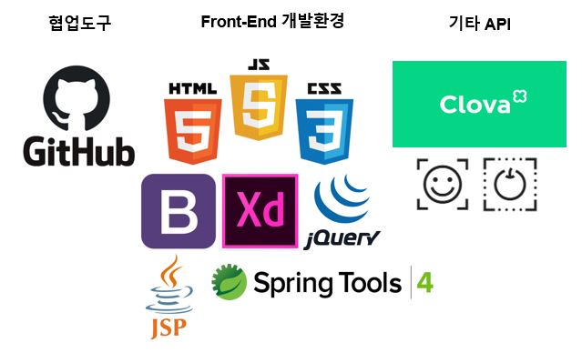
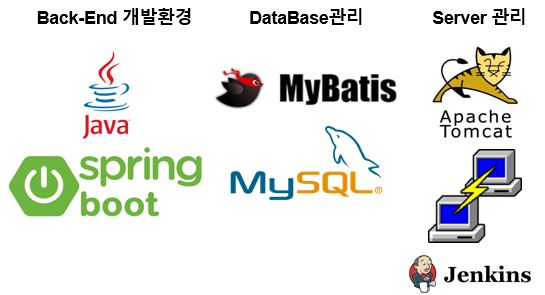
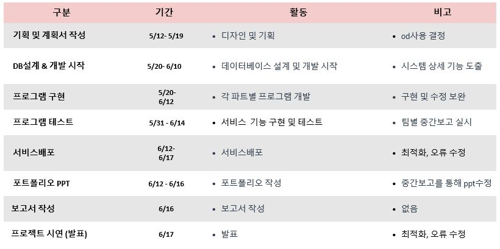
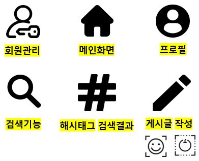
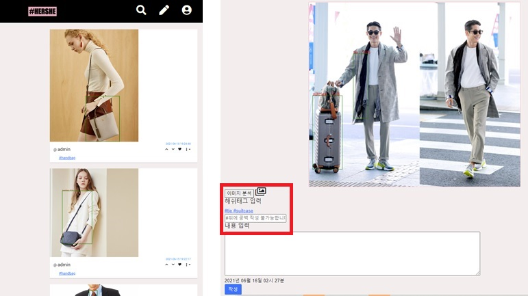
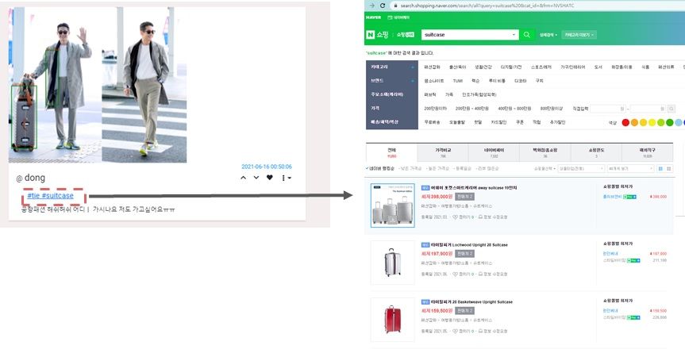
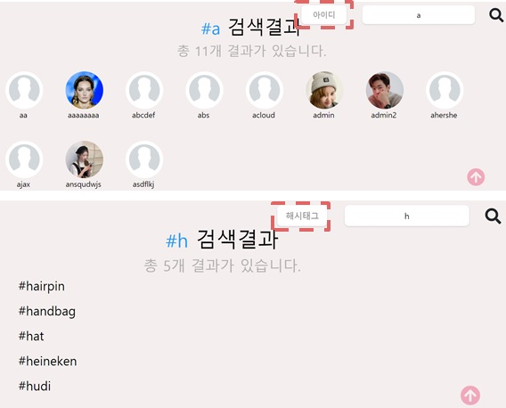
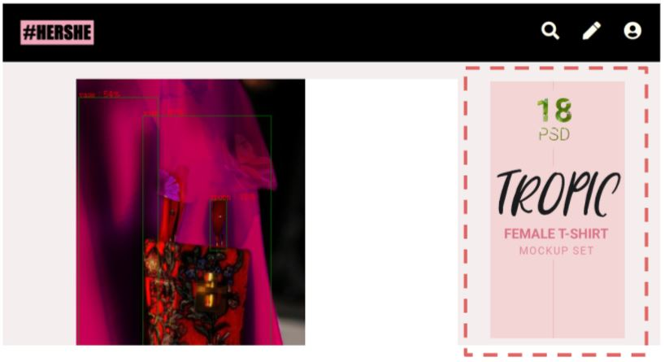
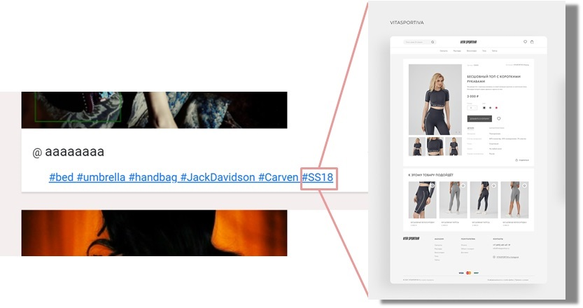
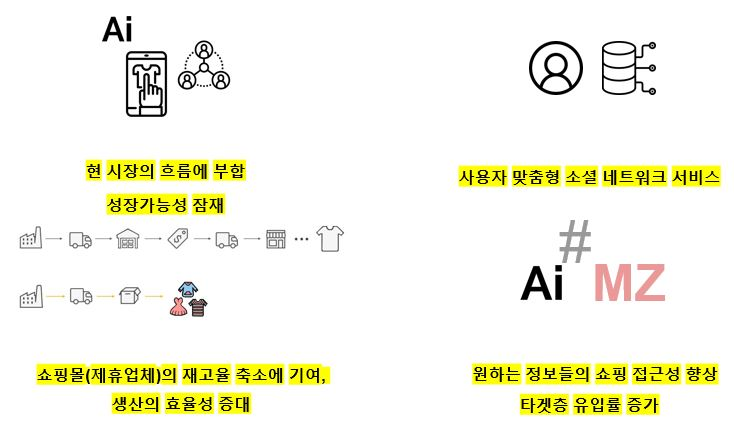

# SNS기반 쇼핑태그 플랫폼 - HashHershe 

> 삼성 멀티캠퍼스 온오프 연계 AI활용 지능형 서비스 개발과정 팀프로젝트
>
>  *Project period* 2020.05.12~2020.06.16
>
> *team* 김승겸, 김다현, 문병전, 안재완, 하은

## 개발 목적

1️⃣ 시장 동향

1. 코로나19로 인한 비대면 의류 소비 확산

2. 소셜미디어 이용자 증가

2️⃣ 문제인식 및 솔루션

1. 쇼핑 SNS 플랫폼의 부재 👉 쇼핑 사용자 중심 SNS 플랫폼 기획

3️⃣ 사용자 중심 UX 벤치마킹 서비스

1. 동네인증 API 도입 계획
2. 택배 교환율 감소
3. Object Detection 기능으로 선택적 정보 제공
4. 사용자 중심 플랫폼 서비스 구축

4️⃣ 기존 쇼핑몰의 단점

1. 수많은 쇼핑몰의 같은 제품이면서 다양한 가격대
2. 다양한 옷의 재질, 색의 존재

5️⃣ 프로젝트 목적과 핵심 기능

1. 소셜 기반 소비자 중심 패션 네트워크로 소비자 중심 UX를 지향, 판매자 중심 지양
2. 네이버 인공지능 API를 도입, 패션트렌드 자동 및 시각화
3. 해시태그를 통한 가격비교 쇼핑몰 연결

## 개발 도구

* 프로젝트 수행 절차

## 프로젝트 수행 결과

* 구현 기능

* 메인페이지(팔로우한 사람의 게시물 무한스크롤) 및 게시글 올리기

* 추출된 해시태그 가격비교 쇼핑몰과 연결

* 프로필 및 게시글

* 검색 결과 (아이디, 이름, 해시태그 검색기능)

* 해시태그 검색 결과

## 예측 수익 모델

1️⃣ 광고 삽입

2️⃣ 제휴 쇼핑몰 연결

## 프로젝트 수행 결과

#### 프로젝트 보완 방안 및 장기화 시 방향성

📱 모바일 앱 출시

👚👕🧥🥼 네이버 Object Detection의 부정확정으로 ximilar와 같은 API로 변경

📷📸 다양한 쇼핑몰과의 연결 (제휴)

## 기대 효과

## 프로젝트 후기

#### 프로젝트 수행 중 어려움 극복 사례

* 협업 과정에 있어 여러 사람이 각자의 맡은 부분을 코딩하기 때문에 병합 과정에서 오류가 많이 발생했으나 각자의 작성했던 코드를 agile적으로 매일 토론과 소통으로 해결함

* 작업 과정에서 맞닥뜨리는 오류와 에러를 해결하기 위해 구글링을 하기도 하고 코드의 논리적 인과관계를 분석하여 스스로 해결할 수 있는 부분은 해결하였고, 그 외 부분은 팀원에게 조언을 구함

#### 프로젝트 수행에서 만족하는 부분

* AJAX 비동기 통신과정에서 필연적으로 순차적으로 데이터를 불러와야 하는 과정이 존재했지만 함수화를 통해 동기적으로 데이터를 불러오는 과정을 최대한 지양하여 데이터 로딩 속도를 높임

* NaverCloud에서 제공하는 AI Service API를 적절하게 사용하여 목표한 서비스 플랫폼으로 완성함
* 각자 맡은 파트에 책임감을 갖고 기능적으로 관리하며 연결한 것이 프로젝트 구성의 완성도를 높임
* 팀원들 개개인의 장단점을 솔직하게 얘기하고, 그에 대한 역량의 조화로 서로의 부족함을 보완해주었다는 점에서 높은 팀워크 점수를 줄 수 있을 것 같음 (강사님으로부터 가장 분위기가 좋은 팀이라는 말씀을 여러번 들음)

#### 프로젝트에서 아쉬운 부분

* 비교적 타이트한 시간안에 개발하다보니 기능이나 UI면에서 계획한 내용을 모두 완성시키지 못한 점
* 모든 과정이 온라인이었기에 소통 및 오류 해결에 있어 어려움이 있던 점
* 사물 인식이 이 프로젝트의 핵심 기능이었으나 NaverCloud의 AI Service를 제공받아 이용하다 보니 서버에 정해진 사물 및 유명인만 인식하고, 자체적으로 추가학습을 시키지 못해 인식률이 떨어졌던 점

#### 프로젝트를 통한 진로설계, 취업분야 탐색 및 결정 등 도움이 된 점

* 직접 문제를 직면하고 해결하는 과정에서 실무적 프로그래밍 능력이 향상됨
* 서비스 기획자와 개발자 간의 의사소통의 중요성을 깨닫고 개발자들이 선호하는 대화방식과 관점 / 기획자들이 선호하는 대화방식과 관점에 대해 이해함
* 코드의 수정 및 유지보수과정이 쉽지 않음을 깨닫고 협업 과정에서 어떻게 접근하여야 하는지 깨달음
